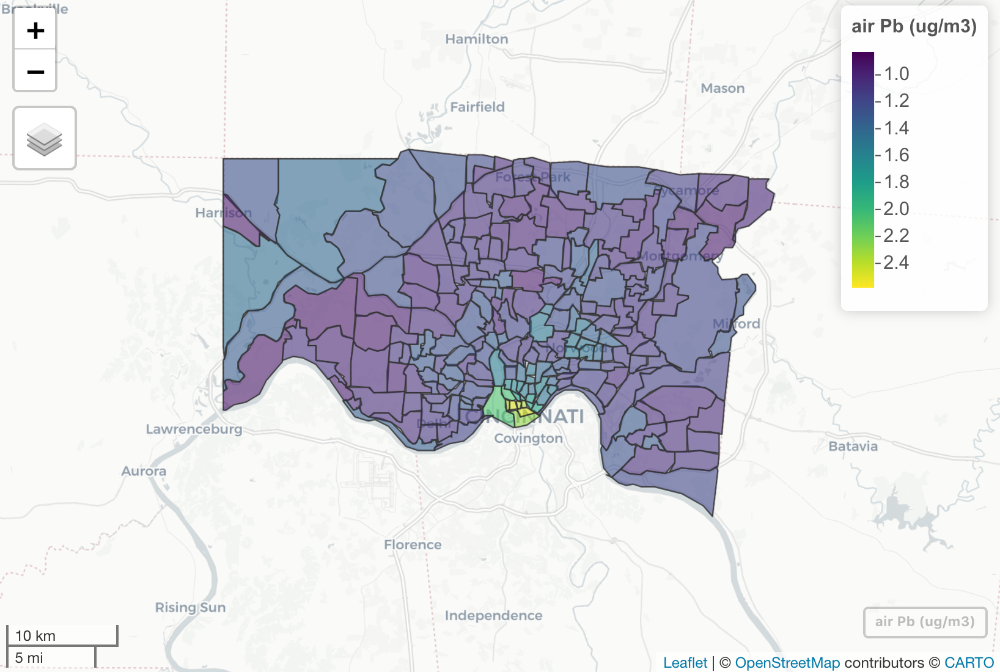

<!-- README.md is generated from README.Rmd. Please edit that file -->

# airPb

<!-- badges: start -->

<!-- badges: end -->

The goal of the airPb package is to easily and reproducibly assess
exposure to airborne lead at specific locations in and around
Cincinnati, Ohio. The package calculates predictions of air lead
exposure from a land use random forest model developed by Dr. Cole
Brokamp based on ambient air sampling in Cincinnati, OH between 2001 and
2005.

The model predictors include greenspace (NDVI) within 1000 meters,
population density within 500 meters, length of bus routes within 900
meters, percent pasure within 800 meters, percent developed open land
within 1100 meters, percent developed medium land within 400 meters,
percent developed low land within 900 meters, and percent developed high
land within 1500 meters.

Additionally, these air lead exposures can be adjusted to account for
the temporal variation associated with changing air lead levels in the
area over time. Scaling factors are constructed using measurements of
airborne lead recorded by the EPA in the Cincinnati area. These scaling
factors are the average air lead measured over a time period of interest
(e.g., gestation, the month leading up to date of hospitilization, etc)
divided by the average air lead recorded over the ambient air sampling
period (2001 to 2005). Scaling factors are then applied to air lead
estimates from the land use model.

## Reference

Cole Brokamp, Roman Jandarov, MB Rao, Grace LeMasters, Patrick Ryan.
Exposure assessment models for elemental components of particulate
matter in an urban environment: A comparison of regression and random
forest approaches. Atmospheric Environment. 151. 1-11. 2017.
<http://dx.doi.org/10.1016/j.atmosenv.2016.11.066>

## Installation

airPb is hosted on GitHub; install with:

    remotes::install_github('geomarker-io/airPb')

## Examples

See our
[vignette](https://geomarker-io.github.io/airPb/articles/airPb_examples.html)
for example usage.
